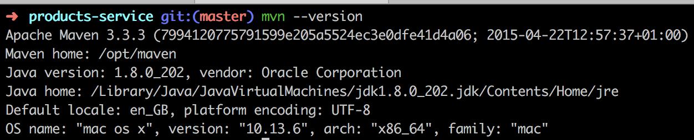

# products-backend

##### System Requirements



##### Start the Tomcat server with Maven

```bash
mvn spring-boot:run
```

##### cURL scripts

###### Create a package

```bash
# default package
source ./scripts/cURL/create_package.sh && createDefaultPackage

# foreign package
source ./scripts/cURL/create_package.sh && createForeignPackage
```

###### Retrieve a package

```bash
source ./scripts/cURL/retrieve_package.sh && retrievePackage
```

###### Update a package

```bash
source ./scripts/cURL/update_package.sh && updatePackage
```

###### Delete a package

```bash
source ./scripts/cURL/delete_package.sh && deletePackage
```

###### List all packages

```bash
source ./scripts/cURL/list_packages.sh && listPackages
```

##### Postman collection

A Postman collection can be found at _./scripts/postman/products-service.postman_collection.json_
and all requests can be imported into https://www.getpostman.com/. 

##### Run unit tests

```bash
cd products-backend && mvn clean test
```
